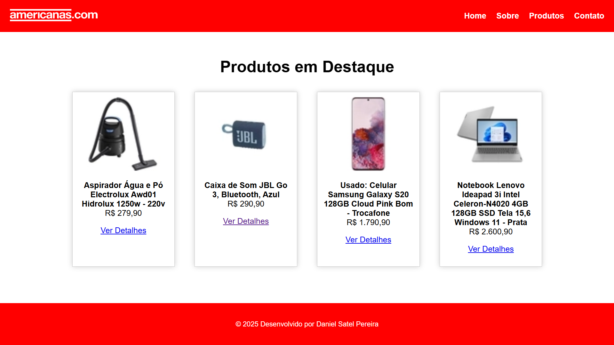
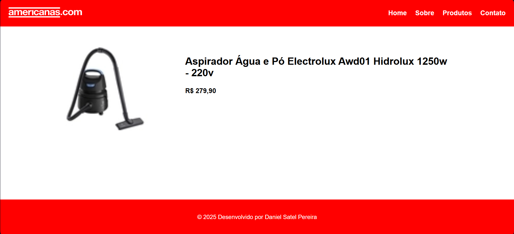
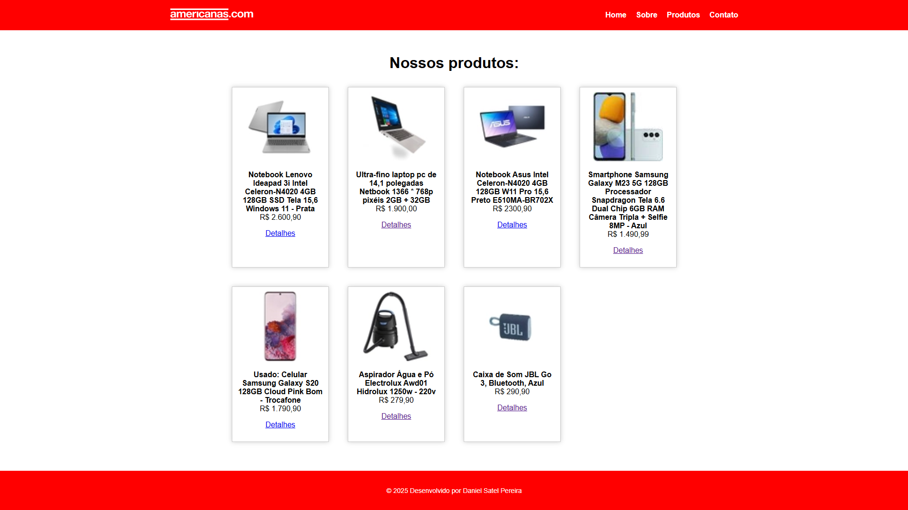
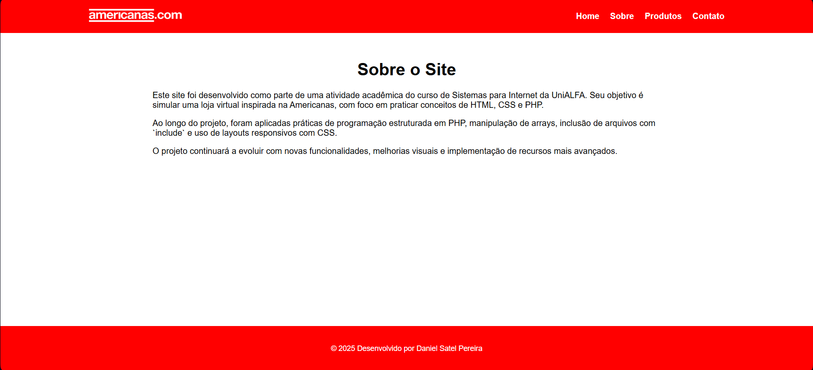

# 🛒 Americanas Clone (Projeto Acadêmico UniALFA)

Este projeto é um **clone simplificado da loja Americanas**, desenvolvido como atividade prática na disciplina de Desenvolvimento Web com PHP, durante o 2º período da graduação em Sistemas para Internet na UniALFA.

---

## 📌 Descrição

O site simula um e-commerce com exibição de produtos, páginas individuais de detalhe, formulário de contato e estrutura modular reutilizável em PHP. O foco principal foi:

- Aprender e aplicar **conceitos fundamentais de PHP**
- Praticar **inclusão de arquivos com `include`**
- Organizar conteúdos via **array associativo**
- Criar uma **estrutura de navegação entre páginas**
- Desenvolver com **HTML, CSS e PHP puros**

---

## 🧱 Funcionalidades

- Página inicial com produtos em destaque aleatórios
- Página de produtos com todos os itens cadastrados
- Página de detalhe de produto dinâmico via `GET`
- Página de contato com alerta de função em construção
- Página "Sobre" institucional
- Página de verificação de idade (`condicoes.php`) para aprendizado de condicionais
- Layout responsivo básico com grid em CSS

---

## 📁 Estrutura de Arquivos

```
americanas-clone-php/
├── css/
│   └── style.css
├── extras/
│   ├── aula_php.php
│   ├── condicoes.php
│   ├── formulario.php
│   └── README.md
├── imagens/
│   ├── [imagens dos produtos em .webp]
│   └── icone.webp, logo.png
├── contato.php
├── dados.php
├── footer.php
├── header.php
├── index.php
├── produto.php
├── produtos.php
├── sobre.php
└── README.md

```

---

## 📸 Capturas de Tela

### 🏠 Página Inicial com produtos em destaque


### 🛒 Página de Detalhes do Produto


### 🧾 Lista Completa de Produtos


### ℹ️ Página Sobre o Projeto


---

## 🚧 Planejamento Futuro

- Adicionar sistema de busca por produtos
- Simular carrinho de compras
- Criar painel administrativo simples
- Aprimorar responsividade
- Integrar com banco de dados

---

## 👨‍💻 Desenvolvedor

**Daniel Satel Pereira**
Estudante de Sistemas para Internet | UniALFA
Email: [danielsatelpereira@gmail.com](mailto:danielsatelpereira@gmail.com)

---

## 📄 Licença

Projeto acadêmico desenvolvido com fins educacionais.
Você pode estudar, adaptar e reutilizar este código livremente, desde que mantenha os devidos créditos.

Este projeto está licenciado sob os termos da [Licença MIT](../../LICENSE.txt).
